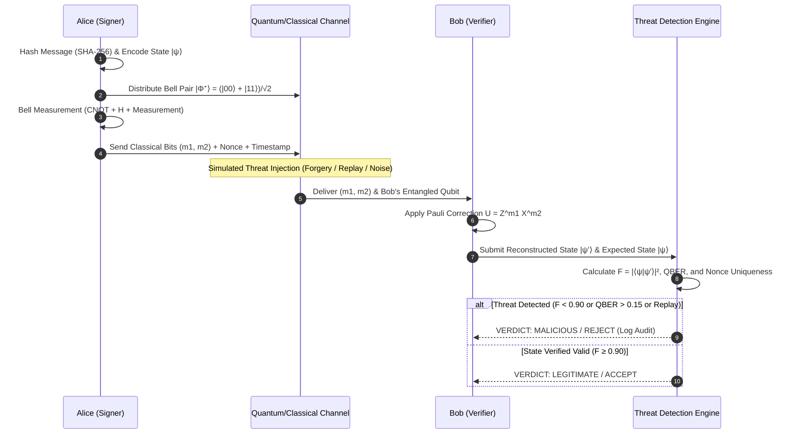

# Quantum-Inspired Cyber Threat Detection for Digital Signature Security (QDS-Framework)


---

## 🔬 Abstract & Executive Summary

As classical asymmetric digital signature schemes (RSA, DSA, ECDSA) become vulnerable to polynomial-time quantum attacks via **Shor's algorithm**, developing quantum and quantum-inspired signature protocols is essential for future post-quantum security architectures.

**QDS-Framework** is a complete, full-stack, quantum-inspired cyber threat detection and verification system for digital signatures. The platform simulates a **teleportation-based Quantum Digital Signature (QDS)** protocol using a high-precision classical NumPy linear algebra engine. It pairs this with a **strictly non-AI, deterministic threat detection engine** that evaluates state fidelity, quantum bit error rate (QBER), statistical mismatch rates, and anti-replay nonces to mathematically identify and mitigate cybersecurity attacks in real time.

---

## ⚠️ Non-AI / Non-ML Deterministic Guarantee

> **STRICT COMPLIANCE NOTICE**:
> This framework contains **ZERO machine learning models, neural networks, heuristic weights, or artificial intelligence algorithms**.

All threat classifications, tamper detection, and verification verdicts are derived purely from:
1. **Quantum Linear Algebra**: Complex Hilbert space state vectors, tensor products, and projective measurement operators.
2. **Deterministic Threshold Rules**:
   - $F < 0.90 \implies$ Critical State Corruption / Eavesdropping
   - $\text{QBER} > 0.15 \implies$ Channel Noise / Quantum Man-in-the-Middle
   - $\mu > 0.15 \implies$ Classical Bit Mismatch / Tampered Signature
   - $\Delta t > 300\text{ s}$ or Duplicate Nonce $\implies$ Replay Attack
   - Rate Limit Exceeded $\implies$ Unauthorized Verification Flooding
3. **Reproducible Proofs**: Every verification output includes the exact mathematical values calculated, providing full transparency and cryptographic explainability.

---

## 🎯 Problem Statement & Proposed Solution

### The Problem
* **Quantum Threat to Classical Cryptography**: Integer factorization and discrete logarithm problems can be solved in $\mathcal{O}((\log N)^3)$ time by Shor's algorithm on fault-tolerant quantum computers, breaking classical digital signatures.
* **Black-Box AI Shortcomings in Security**: Many modern cyber threat detection systems rely on deep neural networks that are prone to hallucination, adversarial manipulation, lack cryptographic determinism, and cannot be mathematically audited.
* **Complex Quantum Verification**: Teleportation-based quantum signatures require multi-stage coordination: Bell-pair generation, state encoding, Bell measurement, classical bit transmission, and unitary Pauli correction.

### The Proposed Solution
* **NumPy Quantum Simulation Engine**: Simulates complex state vectors in $\mathbb{C}^2$, arbitrary single-qubit rotations, Pauli operators ($I, X, Y, Z, H, XZ$), 2-qubit CNOT gates, Bell state creation, and projective measurements with seed-controlled determinism.
* **Teleportation-Based QDS Protocol**: Alice encodes SHA-256 message digests into quantum state vectors, entangles them with shared Bell pairs, measures joint Bell states, and transmits classical correction bits ($m_1, m_2$) to Bob for deterministic state reconstruction.
* **Mathematical Threat Engine**: Analyzes transmitted states against expected signatures using exact closed-form equations for State Fidelity $F$, Quantum Bit Error Rate ($\text{QBER}$), and Forgery Probability $P_f$.
* **Modern Enterprise Web Architecture**: A production-grade FastAPI backend with JWT authentication, RBAC, persistent database storage, and a responsive React 18 + Vite dashboard styled with a clean scientific theme.

---

## 🏛️ System Architecture

```
                                  ┌────────────────────────────────────────────────────────┐
                                  │                REACT 18 + VITE FRONTEND                │
                                  │   (Bright Scientific UI · Recharts · Lucide Icons)     │
                                  └─────────────────────────┬──────────────────────────────┘
                                                            │ REST APIs (JSON + JWT)
                                                            ▼
                                  ┌────────────────────────────────────────────────────────┐
                                  │                  FASTAPI REST BACKEND                  │
                                  │  - Auth & RBAC (User, Security Analyst, Admin)         │
                                  │  - Session Manager & Protocol Orchestrator             │
                                  │  - System Health & Security Metrics Collector          │
                                  └────────────┬─────────────────────────────┬─────────────┘
                                               │                             │
                        ┌──────────────────────▼───────┐             ┌───────▼──────────────────────┐
                        │    SQLAlchemy 2.0 ORM        │             │   QUANTUM SIMULATION ENGINE  │
                        │  - User Accounts             │             │   - Complex State Vectors    │
                        │  - QDS Sessions              │             │   - I, X, Y, Z, H, CNOT      │
                        │  - Verification Logs         │             │   - Bell Pair Entanglement   │
                        │  - Threat Audit Trails       │             │   - Teleportation Protocol   │
                        └──────────────┬───────────────┘             └───────┬──────────────────────┘
                                       │ PostgreSQL / SQLite                 │ Quantum States & Bits
                                       ▼                                     ▼
                        ┌──────────────────────────────┐             ┌──────────────────────────────┐
                        │   PERSISTENT STORAGE         │             │  DETERMINISTIC THREAT ENGINE │
                        │  (Docker Volume / DB Disk)   │             │  - State Fidelity F          │
                        │                              │             │  - QBER & Mismatch Rate      │
                        │                              │             │  - Nonce & Replay Protection │
                        │                              │             │  - Forgery Probability Pf    │
                        └──────────────────────────────┘             └──────────────────────────────┘
```

### Core Pipeline Flowchart (Mermaid)



---

## ⚛️ Quantum Mathematical Model

### 1. Single Qubit Representation
A single qubit state $|\psi\rangle \in \mathbb{C}^2$ is represented as a normalized linear superposition of computational basis states $\{|0\rangle, |1\rangle\}$:
$$|\psi\rangle = \alpha |0\rangle + \beta |1\rangle = \begin{pmatrix} \alpha \\ \beta \end{pmatrix}, \quad \text{where } \alpha, \beta \in \mathbb{C} \text{ and } |\alpha|^2 + |\beta|^2 = 1$$

### 2. Quantum Logic Operators
The system implements canonical unitary matrices:
$$\sigma_0 = I = \begin{pmatrix} 1 & 0 \\ 0 & 1 \end{pmatrix}, \quad \sigma_1 = X = \begin{pmatrix} 0 & 1 \\ 1 & 0 \end{pmatrix}, \quad \sigma_2 = Y = \begin{pmatrix} 0 & -i \\ i & 0 \end{pmatrix}, \quad \sigma_3 = Z = \begin{pmatrix} 1 & 0 \\ 0 & -1 \end{pmatrix}$$

The Hadamard gate creates uniform superposition:
$$H = \frac{1}{\sqrt{2}} \begin{pmatrix} 1 & 1 \\ 1 & -1 \end{pmatrix}$$

The two-qubit Controlled-NOT ($\text{CNOT}$) operator:
$$\text{CNOT} = \begin{pmatrix} 1 & 0 & 0 & 0 \\ 0 & 1 & 0 & 0 \\ 0 & 0 & 0 & 1 \\ 0 & 0 & 1 & 0 \end{pmatrix}$$

### 3. Bell State Entanglement
The maximally entangled Bell state $|\Phi^+\rangle$ is created by applying $H$ to the first qubit followed by a $\text{CNOT}$:
$$|\Phi^+\rangle = \text{CNOT} (H \otimes I) |00\rangle = \frac{|00\rangle + |11\rangle}{\sqrt{2}} = \frac{1}{\sqrt{2}} \begin{pmatrix} 1 \\ 0 \\ 0 \\ 1 \end{pmatrix}$$

### 4. Teleportation Protocol
For message state $|\psi\rangle = \alpha|0\rangle + \beta|1\rangle$ and shared Bell pair $|\Phi^+\rangle$:
1. Total 3-qubit state: $|\Psi_0\rangle = |\psi\rangle \otimes |\Phi^+\rangle$.
2. Alice applies $\text{CNOT}_{1,2}$ followed by $H_1$.
3. Alice measures qubits 1 and 2, yielding classical bits $(m_1, m_2) \in \{0, 1\}^2$.
4. Bob applies conditional unitary Pauli correction $U = Z^{m_1} X^{m_2}$ to qubit 3:
   - $m_1 m_2 = 00 \implies U = I$
   - $m_1 m_2 = 01 \implies U = X$
   - $m_1 m_2 = 10 \implies U = Z$
   - $m_1 m_2 = 11 \implies U = XZ$
5. Bob's post-correction state: $|\psi_{\text{reconstructed}}\rangle = |\psi\rangle$.

### 5. State Fidelity ($F$)
State fidelity measures the overlap between pure state vectors:
$$F(|\psi\rangle, |\phi\rangle) = |\langle \psi | \phi \rangle|^2 = \left| \sum_{i} \psi_i^* \phi_i \right|^2, \quad 0 \le F \le 1$$

### 6. Quantum Bit Error Rate ($\text{QBER}$)
$$\text{QBER} = \frac{N_{\text{errors}}}{N_{\text{total}}} = \frac{1}{N} \sum_{k=1}^{N} \delta(b_k^{\text{sent}} \ne b_k^{\text{measured}})$$

---

## 🛡️ Deterministic Threat Detection Rules

| Threat Vector | Detection Condition | Severity | Action |
|:---|:---|:---:|:---:|
| **Signature Forgery** | $F < 0.90 \lor \mu > 0.15 \lor P_f \ge 0.50$ | `CRITICAL` | Reject signature, flag forgery attempt |
| **Impersonation Attack** | Forged public key state / hash mismatch | `CRITICAL` | Block verification, log identity anomaly |
| **Replay Attack** | Nonce in cache $\lor \Delta t > 300\text{ s}$ | `HIGH` | Discard message, record replay security event |
| **Channel Manipulation** | $\text{QBER} > 0.15 \land F < 0.95$ | `HIGH` | Flag quantum channel noise/MITM |
| **Unauthorized Verification** | Requests $> 100/\text{min}$ or unverified role | `MEDIUM` | Rate limit / HTTP 403 Forbidden |

### Forgery Probability Formula
$$P_f = 1 - F + \frac{\mu}{2}$$
Where $F$ is State Fidelity and $\mu$ is the classical bit mismatch rate.

---

## 💻 Tech Stack

* **Backend**:
  * Python 3.11+
  * FastAPI 0.110+ (Asynchronous REST API)
  * Pydantic v2 (Input validation & schemas)
  * SQLAlchemy 2.0 (ORM database persistence)
  * PyJWT + Passlib / Bcrypt (Authentication & RBAC)
  * NumPy 1.26+ (Quantum linear algebra engine)
  * SQLite (Local dev & test isolation) / PostgreSQL (Production)
* **Frontend**:
  * React 18.2 + TypeScript 5
  * Vite 5 (Fast build tooling)
  * Tailwind CSS (Bright scientific design system)
  * Lucide React (Icons)
  * Recharts (Real-time fidelity, QBER, & threat analytics)
  * Axios (API client with interceptors)
* **DevOps & Infrastructure**:
  * Docker (Multi-stage container builds)
  * Docker Compose (Multi-service orchestration)
  * Nginx (Reverse proxy and SPA static routing)

---

## 📂 Project Structure

```
SIH-QDS/
├── backend/
│   ├── app/
│   │   ├── api/
│   │   │   ├── auth.py          # User registration, login, JWT token generation
│   │   │   ├── qds.py           # Signature generation & verification endpoints
│   │   │   ├── threats.py       # Threat injection & deterministic detection
│   │   │   └── analytics.py     # Real-time metrics & threat statistics
│   │   ├── core/
│   │   │   ├── config.py        # Environment variables & CORS settings
│   │   │   ├── database.py      # SQLAlchemy engine & session factory
│   │   │   └── security.py      # Password hashing, JWT, and RBAC guards
│   │   ├── db/
│   │   │   ├── models.py        # SQLAlchemy models (User, Session, ThreatLog)
│   │   │   └── schemas.py       # Pydantic request/response schemas
│   │   ├── quantum/
│   │   │   ├── state.py         # Qubit state vectors & normalization
│   │   │   ├── gates.py         # Quantum gates (I, X, Y, Z, H, CNOT)
│   │   │   ├── bell.py          # Bell pair generation & measurement
│   │   │   ├── teleportation.py # Quantum teleportation engine
│   │   │   └── measurement.py   # Projective measurement operators
│   │   ├── qds/
│   │   │   ├── hasher.py        # SHA-256 message hashing
│   │   │   ├── encoder.py       # Classical bit to quantum state mapping
│   │   │   ├── signer.py        # Alice's signature creation routine
│   │   │   ├── verifier.py      # Bob's verification routine
│   │   │   └── session.py       # Protocol session management & state machine
│   │   ├── threats/
│   │   │   ├── detector.py      # Deterministic non-AI threat detection engine
│   │   │   ├── rules.py         # Mathematical detection thresholds
│   │   │   ├── simulator.py     # Attack vectors (Forgery, Replay, Channel Noise)
│   │   │   └── replay_guard.py  # Nonce tracking & timestamp sliding window
│   │   └── main.py              # FastAPI application entry point
│   ├── tests/                   # 72+ Automated unit, protocol, & E2E tests
│   ├── Dockerfile               # Production multi-stage Python container
│   ├── requirements.txt         # Backend Python dependencies
│   └── .env.example             # Template for backend environment variables
├── frontend/
│   ├── src/
│   │   ├── components/
│   │   │   ├── Navbar.tsx       # Scientific top navigation & role badge
│   │   │   ├── MetricCard.tsx   # Stat cards with trend indicators
│   │   │   └── DemoTimeline.tsx # 9-stage guided protocol execution timeline
│   │   ├── pages/
│   │   │   ├── Dashboard.tsx    # Guided demo mode, live metrics, and timeline
│   │   │   ├── Signature.tsx    # Interactive QDS signature generation
│   │   │   ├── Verification.tsx # Signature verification & attack simulation
│   │   │   ├── ThreatLogs.tsx   # Audit log table with severity filters
│   │   │   ├── Analytics.tsx    # Real-time QBER/Fidelity charts & distribution
│   │   │   └── Login.tsx        # Secure authentication & user onboarding
│   │   ├── services/
│   │   │   └── api.ts           # Axios API client & typed endpoints
│   │   ├── types/
│   │   │   └── index.ts         # TypeScript definitions
│   │   └── App.tsx              # Application layout & protected routing
│   ├── Dockerfile               # Multi-stage build (Node 20 -> Nginx Alpine)
│   ├── nginx.conf               # Nginx SPA fallback configuration
│   ├── package.json             # Frontend dependencies
│   └── .env.example             # Template for frontend environment variables
├── docker-compose.yml           # Multi-service production orchestration
└── README.md                    # System documentation
```

---

## 🚀 Quick Start & Local Setup

### Prerequisites
* **Python**: 3.11 or higher
* **Node.js**: v18 or higher (v20 recommended)
* **npm**: v9 or higher

### Option 1: Native Local Setup

#### 1. Backend Setup
```bash
# Navigate to backend directory
cd backend

# Create and activate virtual environment
python -m venv venv
# On Windows PowerShell:
.\venv\Scripts\Activate.ps1
# On Linux/macOS:
source venv/bin/activate

# Install dependencies
pip install -r requirements.txt

# Copy environment variables
cp .env.example .env

# Run FastAPI server
uvicorn backend.app.main:app --reload --host 0.0.0.0 --port 8000
```
Backend will be available at: `http://localhost:8000`  
Swagger API Docs: `http://localhost:8000/docs`

#### 2. Frontend Setup
```bash
# In a new terminal, navigate to frontend directory
cd frontend

# Install dependencies
npm install

# Copy environment variables
cp .env.example .env

# Run Vite development server
npm run dev
```
Frontend will be available at: `http://localhost:5173`

---

## 🐳 Docker & Docker Compose Deployment

The project includes multi-stage production Dockerfiles and a unified `docker-compose.yml` that orchestrates:
1. **`backend`**: Python 3.11-slim, optimized non-root execution.
2. **`frontend`**: Node 20 builder outputting static assets to an Nginx Alpine container.
3. **`postgres`**: Production PostgreSQL database with persistent volume storage and health checks.

### One-Command Deployment
```bash
# Build and launch all services in detached mode
docker-compose up -d --build

# View container status
docker-compose ps

# Follow application logs
docker-compose logs -f
```

* **Frontend UI**: `http://localhost:3000` (or `http://localhost:5173` depending on port binding)
* **Backend API**: `http://localhost:8000`
* **Health Check**: `http://localhost:8000/health`
* **API Documentation**: `http://localhost:8000/docs`

To shut down services:
```bash
docker-compose down
```

---

## 📡 REST API Reference

| Method | Endpoint | Access Level | Description |
|:---:|:---|:---:|:---|
| `GET` | `/health` | Public | System health check (database connection, uptime, status) |
| `GET` | `/api/v1/system/info` | Public | Architecture overview and deterministic engine status |
| `POST` | `/api/v1/auth/register` | Public | Register new user account (`USER`, `SECURITY_ANALYST`, `ADMIN`) |
| `POST` | `/api/v1/auth/login` | Public | Authenticate user and receive JWT Bearer token |
| `GET` | `/api/v1/auth/me` | Authenticated | Get current authenticated user profile and roles |
| `POST` | `/api/v1/qds/create-signature` | Authenticated | Encode message, generate Bell pairs, and run teleportation |
| `POST` | `/api/v1/qds/verify-signature` | Authenticated | Reconstruct state, calculate Fidelity $F$, and verify validity |
| `GET` | `/api/v1/qds/session/{session_id}` | Authenticated | Retrieve complete QDS session metadata and quantum states |
| `POST` | `/api/v1/threats/simulate` | Authenticated | Inject cyber threats (`FORGERY`, `REPLAY`, `CHANNEL_NOISE`) |
| `POST` | `/api/v1/threats/detect` | Authenticated | Execute deterministic non-AI threat detection on a session |
| `GET` | `/api/v1/threats/logs` | Authenticated | Fetch auditable threat detection history and metrics |
| `GET` | `/api/v1/analytics/overview` | Authenticated | System-wide statistics (total sessions, threats detected, average $F$) |
| `GET` | `/api/v1/analytics/fidelity-trend` | Authenticated | Time-series data of state fidelity and error rates |
| `GET` | `/api/v1/analytics/threat-breakdown` | Authenticated | Categorical breakdown of detected attacks |

---

## 🧪 Comprehensive Testing Suite

The framework includes automated test coverage spanning unit testing, protocol validation, threat detection rules, API endpoints, and end-to-end integration workflows.

### Run All Backend Tests (93 Tests)
```bash
# Canonical test command (discovers all 93 tests)
python -m unittest discover -s backend/tests -p "*_unittest.py"

# Broad discovery command (also discovers all 93 tests)
python -m unittest discover -s backend/tests -p "test*.py"
```

### Run Individual Test Suites
```bash
# 1. Quantum Simulation Engine Tests (18 tests)
python -m unittest backend.tests.test_quantum_engine_unittest

# 2. QDS Teleportation Protocol Tests (20 tests)
python -m unittest backend.tests.test_qds_protocol_unittest

# 3. Deterministic Threat Engine Tests (27 tests)
python -m unittest backend.tests.test_threat_engine_unittest

# 4. FastAPI REST API Tests (23 tests)
python -m unittest backend.tests.test_api_unittest

# 5. End-to-End Integration Tests (5 comprehensive test pipelines)
python -m unittest backend.tests.test_e2e_unittest

# 6. Phase 8 Real-Time SOC, Incidents, Correlation & Observability Tests (36 tests)
python -m unittest backend.tests.test_phase8_unittest

# 7. Phase 9 Enterprise Resilience, Security Audit & Reliability Tests (37 tests)
python -m unittest backend.tests.test_phase9_unittest

# Total Test Suite Discovery (166 tests passing):
python -m unittest discover -s backend/tests -p "*_unittest.py"
```

### Run Frontend Type Check & Build
```bash
cd frontend
npm run build
```

---

## 🧭 Guided Interactive Demo Mode

The web application features an interactive **Guided Demo Mode** accessible directly on the main dashboard (`/dashboard`), allowing users to witness the entire quantum signature and threat detection workflow in real time:

1. **Scenario A: Legitimate Signature Flow**
   - Live 9-stage execution: User Input $\to$ SHA-256 Hash $\to$ State Encoding $\to$ Bell Entanglement $\to$ Bell Measurement $\to$ Classical Transmission $\to$ Pauli Correction $\to$ Deterministic Verification $\to$ Accepted Verdict ($F = 1.0$, $\text{QBER} = 0.0\%$).
2. **Scenario B: Attack Simulation & Real-Time Detection Flow**
   - Select attack vector (Signature Forgery, Replay Attack, Quantum Channel Noise).
   - Injects simulated tampering via live API calls.
   - Runs post-attack re-verification.
   - Displays real-time Before vs After comparison: State Fidelity ($F$), $\text{QBER}$, Mismatch Rate ($\mu$), and Forgery Probability ($P_f$).

---

## 📌 Limitations & Scope

* **Classical Mathematical Simulation**: This system executes quantum state mathematics (Hilbert space vectors, unitary matrix multiplications, projective measurements) using Python's NumPy library. It simulates quantum phenomena on classical von Neumann hardware and is **not connected to physical quantum hardware (QPU)**.
* **Qubit Dimension Scalability**: Because simulating an $n$-qubit state vector on classical hardware scales exponentially ($\mathcal{O}(2^n)$ in memory and operations), the simulation is optimized for cryptographic message digests encoded across practical register blocks.
* **Research & Educational Prototype**: This software serves as an academic and research prototype for demonstrating post-quantum threat detection mechanisms and evaluating non-AI deterministic security paradigms.

---

## 📄 License
This project is released under the [MIT License](LICENSE).
